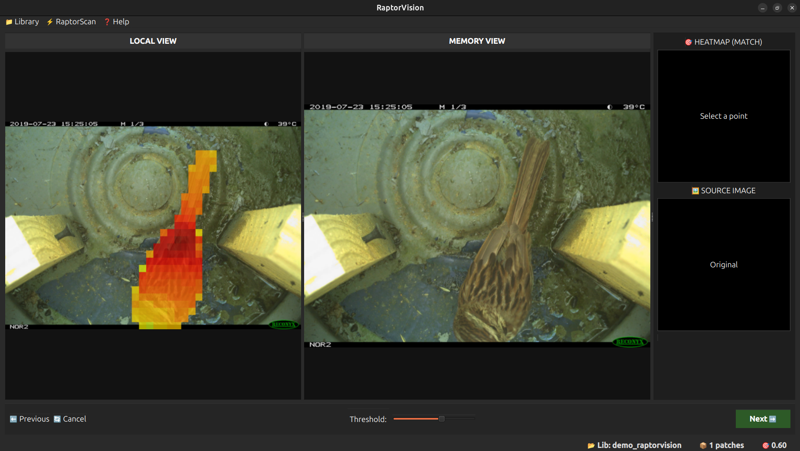

<h1 align="center">
  
  RaptorVision
</h1>

[](https://www.gnu.org/licenses/gpl-3.0)
[](https://badge.fury.io/py/raptor-vision)

**RaptorVision** is an open-source tool developed by Rémi Pérenne, built upon Meta's **DINOv3** foundation models. It allows anyone to create a custom object detection model with just a few clicks, requiring only a handful of example images.

## Why RaptorVision?

This project was born from a specific need in biology: sorting through thousands of images from wildlife camera traps. While excellent tools like [MegaDetector](https://github.com/agentmorris/MegaDetector/tree/main) exist, they are often based on the YOLO architecture, which requires thousands of annotated images to recognize a specific species. This makes them difficult to use for rare species where data is scarce.

**RaptorVision** changes the game by using "few-shot learning":
- **Efficiency:** Learns what your target looks like from just 1 or 2 clicks.
- **Versatility:** Works for animals or any specific entity.
- **Speed:** Drastically reduces the time spent manually sorting images that do not contain what you want.

*The name is a nod to Meta's DINO model (Velociraptor is a dinosaur) and the fact that the software acts as a "predator" finding its prey (your data) within a sea of images.*

---

## Installation

RaptorVision is available on PyPI. You can install it using pip:

```bash
pip install raptor-vision
```

### Model Weights Setup

Due to Meta's license agreement, the model weights cannot always be downloaded automatically. If the software fails to download them on the first run, follow these steps:

1.  Visit the [Meta DINO Download Page](https://ai.meta.com/resources/models-and-libraries/dinov2-downloads/) and fill out the form.
2.  Download the **Small**, **Base**, or **Large** models (the *Small* version is sufficient for 90% of use cases).
3.  You will obtain files named like:
    * `dinov3_vits16_pretrain_lvd1689m-08c60483.pth` (**Small**)
    * `dinov3_vitb16_pretrain_lvd1689m-73cec8be.pth` (**Base**)
    * `dinov3_vitl16_pretrain_lvd1689m-8aa4cbdd.pth` (**Large**)
4.  Launch `raptor-vision`. If the models are missing, the terminal will display the specific **Torch cache path** on your system.
5.  Copy your downloaded `.pth` files into that directory and restart the application.

---

## Usage Guide

A comprehensive user guide is integrated directly within the RaptorVision interface. Simply launch the app to explore the features!

By default raptor vision is launched with dino-small and an image resolution (the length of the shorter side of the image) of 672px. If you find that RaptorVision does not detect correctly the entities on your images you can try to increase the resolution (be carefull it shall be a multiple of 16) or to use a better version of dino by typing: `raptor-vision --model-size=[size] --model_resolution=[res]` where size can be small, base or large and res has to be a multiple of 16.

---

## Examples & Performance

### 1. Point-and-Detect
Simply click on an object (e.g., a frog) to teach the model. The left panel shows the reference selection:


Select one bird...



...and RaptorVision automatically detects the others in subsequent frames:


*Note: The top-right window shows which memory image the model is currently using for detection.*

### 2. Complex Scenarios
RaptorVision handles visual diversity well. By clicking on a lizard, the model successfully identifies other lizards and even a snake in the same environment.


*Tip: If the model is too sensitive (e.g., picking up a snake when you only want lizards), you can easily adjust the sensitivity threshold in the UI.*

### 3. RaptorScan (Batch Processing)
For large datasets, RaptorVision generates detection heatmaps and automates file management.

**Original Image:**


**Detection Heatmap:**


**RaptorScan Interface:**
You can process entire folders, automatically copy images containing detections to a new folder, and export detailed statistics (CSV/TXT) for analysis in Python or Excel.


---

## Credits & Data
- **Developer:** Rémi Pérenne ([remi.perenne@etu.minesparis.psl.eu](mailto:remi.perenne@etu.minesparis.psl.eu))
- **Image Credits:** Antonin Conan (Biologist) and the [LILA Biodiversity Dataset](https://lila.science/datasets/ohio-small-animals/).

---
*License: This project is licensed under the GPLv3 License.*